## QT-Awesome
收集 Qt5/Qt6 优秀应用程序、工具。

### 编辑器   

各类文本、代码、HTML、图片、节点流等的可视化编辑器。   

* QtNodes   
Qt Node Editor. Dataflow programming framework   
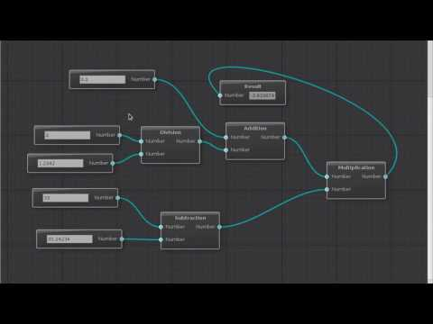   
https://github.com/paceholder/nodeeditor

* NotepadNext   
A cross-platform, reimplementation of Notepad++   
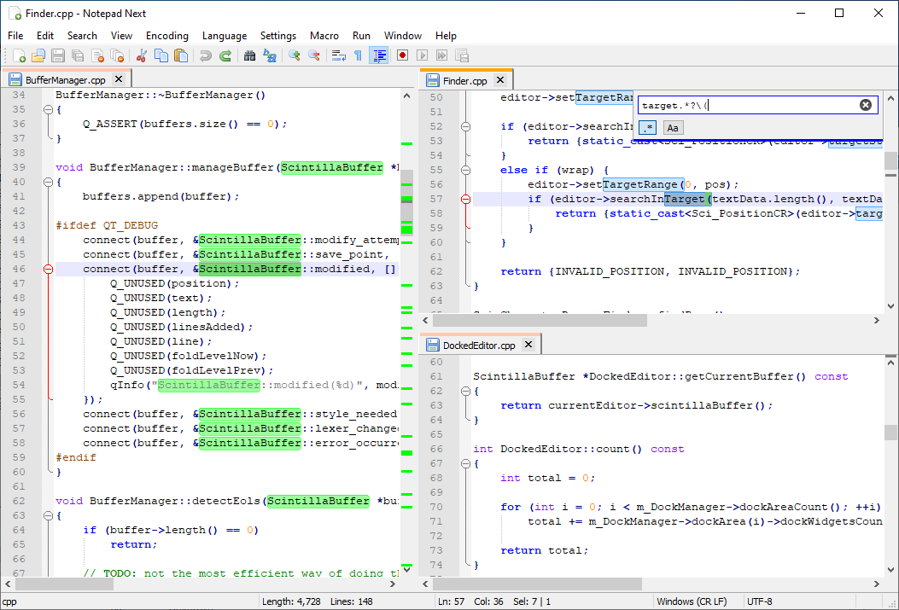   
https://github.com/dail8859/NotepadNext

* Heimer   
一个使用Qt编写的简单跨平台思维导图、图表和笔记工具。   
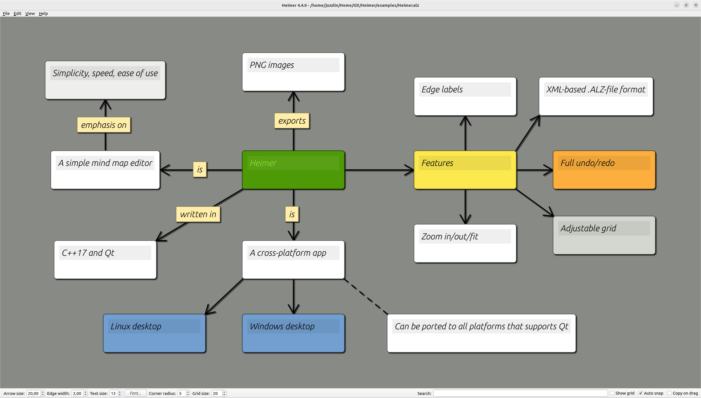   
https://github.com/juzzlin/Heimer

* QuickQanava
C++17 network / graph visualization library - Qt6 / QML node editor.   
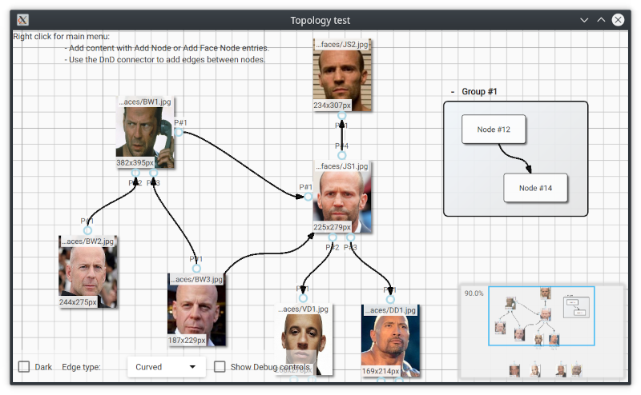   
https://github.com/cneben/QuickQanava

* Paint.software   
An open-source clone of Paint.NET for Linux — built with C++ & Qt6.  
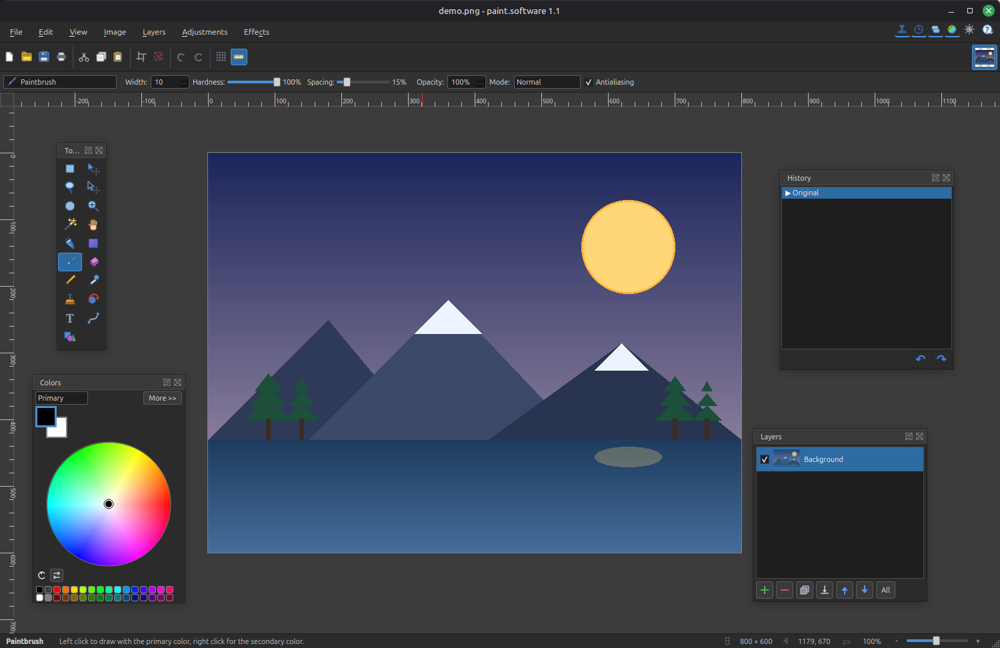  
https://github.com/Univers4craft/paint.software

* LightMark   
基于 Qt6 + C++17 的跨平台 Markdown 编辑器，集成 DeepSeek AI 写作助手。   
https://github.com/lzh1617055800/Markdown-fixed

* qhexedit2   
Binary Editor for Qt   
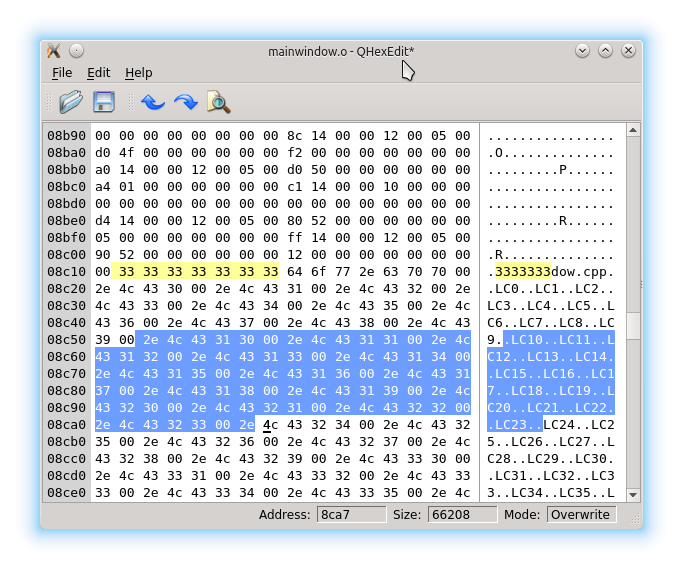   
https://github.com/Simsys/qhexedit2

### 多媒体应用
* VLC-Qt
Wrapper for libvlc that lets you add a VLC-like media player to your application.   
https://github.com/vlc-qt/vlc-qt

* Amber Video Editor   
free open-source non-linear video editor (Qt 6, FFmpeg, Qt RHI: Vulkan/Metal/D3D/OpenGL)   
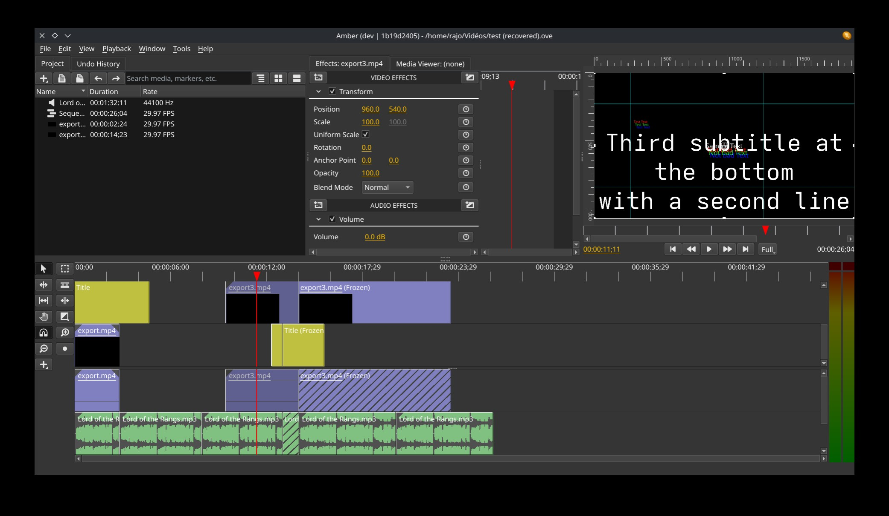
https://github.com/baptisterajaut/amber

* QtAV   
基于Qt和FFmpeg的跨平台高性能音视频播放框架   
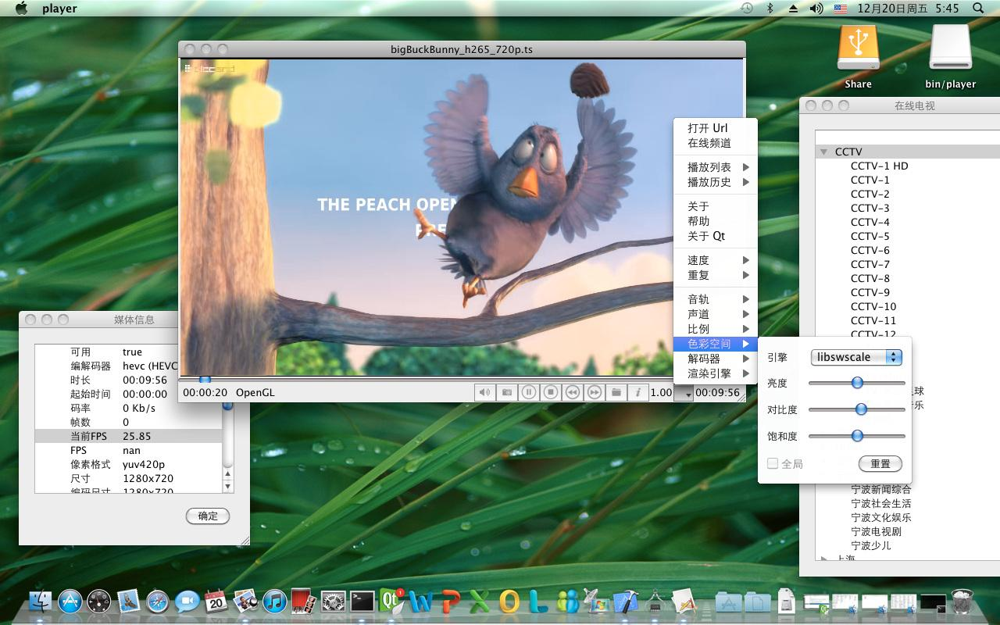   
https://www.qtav.org/

* MidiEditor   
AI-powered MIDI editor - compose and edit MIDI with natural language via the built-in MidiPilot AI copilot.   
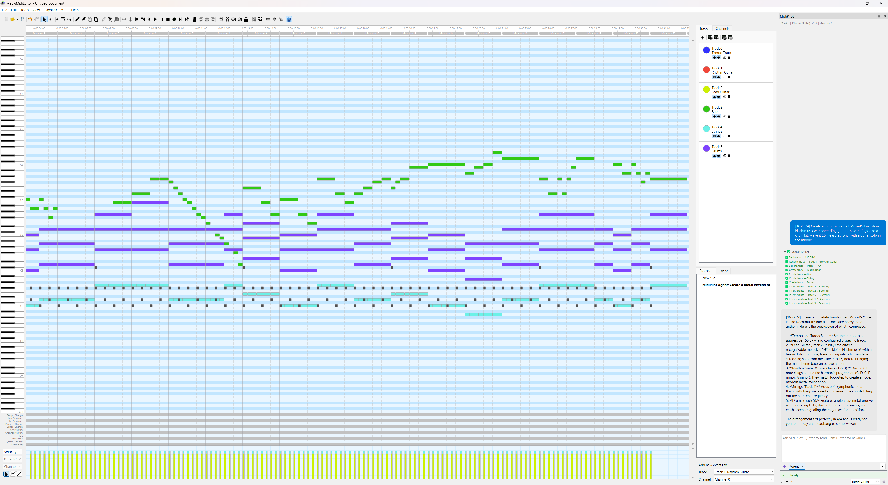
https://github.com/happytunesai/MidiEditor_AI

### UI   
* QtAwesome   
Add Font Awesome icons to your Qt application. Other icon sets are supported, too.

### 其他   
* QSimpleUpdater   
一个Qt应用程序自动更新库。   
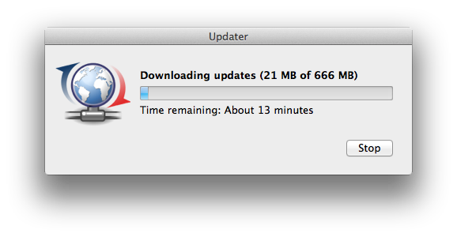   
https://github.com/alex-spataru/QSimpleUpdater

* mupdf-qt   
Qt wrapper for the MuPDF PDF viewer.   
https://xiangxw.github.io/mupdf-qt

* QtLua   
Use Lua as a scripting language for Qt-based software.   
http://www.nongnu.org/libqtlua

* Qtilities   
Qtilities is a set of well documented and mature Qt C++ libraries which provides building blocks for Qt applications, allowing rapid application development.  
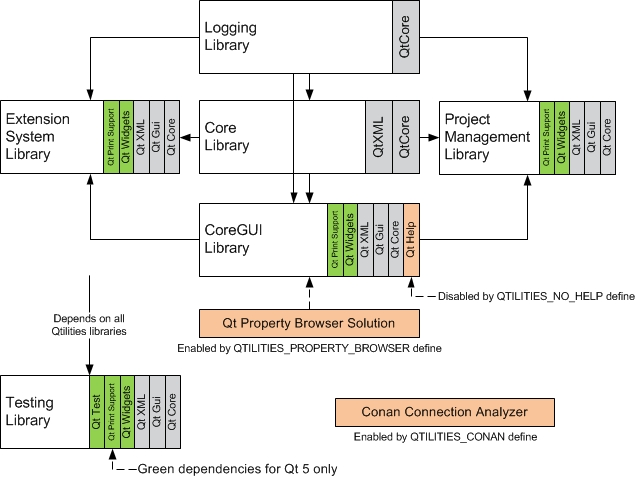   
https://jpnaude.github.io/Qtilities/